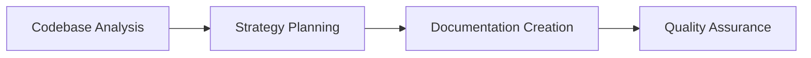

# Getting Started Guide
## Introduction
The `workdir/nvidia-demo` project is a documentation and planning system that utilizes configuration files, code files, and documentation to provide a comprehensive introduction to the project and its components.

## Architecture
The system employs a multi-agent workflow divided into two key stages:
### Ingestion Phase
- **WebsiteSearchTool:** This tool is used to embed and index mermaid examples from mermaid.js.org website using NVIDIA NeMo Retriever E5 embedding NIM.
### Agent Flow
1. Codebase Analysis and Strategy Planning:
    - Analyze Codebase: Planner agents inspect the repository to map its structure, identify key components, and understand interdependencies.
    - Develop Strategy: They create a tailored documentation plan based on the analysis.
2. Documentation Creation and Review:
    - High-Level Documentation: One agent generates clear, comprehensive documentation introducing the project and its architecture.
    - Quality Assurance: Another agent ensures accuracy, consistency, and completeness across all documentation.

## Setup Instructions
### Prerequisites
1. Python 3.10+
2. NVIDIA API Key

### Installation
1. Clone this repository
2. Install dependencies:
   ```bash
   pip install -r requirements.txt
   ```
3. Set up your environment variables (see below).
4. Run the Jupyter notebook.
5. Generated documentation will be available in the `docs` directory.

### Setting up NVIDIA API Key
1. Visit [NVIDIA NIM](https://build.nvidia.com/nim).
2. Select the **llama-3.3-70b-instruct** model.
3. Retrieve your API key from the right panel.
4. Set your environment variables:
   ```bash
   export NVIDIA_NIM_API_KEY=your_api_key
   ```
   Alternatively, create a `.env` file in the project root:
   ```bash
   NVIDIA_NIM_API_KEY=your_api_key
   ```

## Mermaid Diagrams
Mermaid diagrams are used to visualize the architecture and workflow of the project. Here's an example of a mermaid diagram:

This diagram shows the workflow of the project, from codebase analysis to documentation creation and quality assurance.

## Conclusion
This Getting Started Guide provides a comprehensive introduction to the `workdir/nvidia-demo` project and its components. By following the setup instructions and using mermaid diagrams to visualize the architecture and workflow, users can gain a deeper understanding of the project and its functionality.